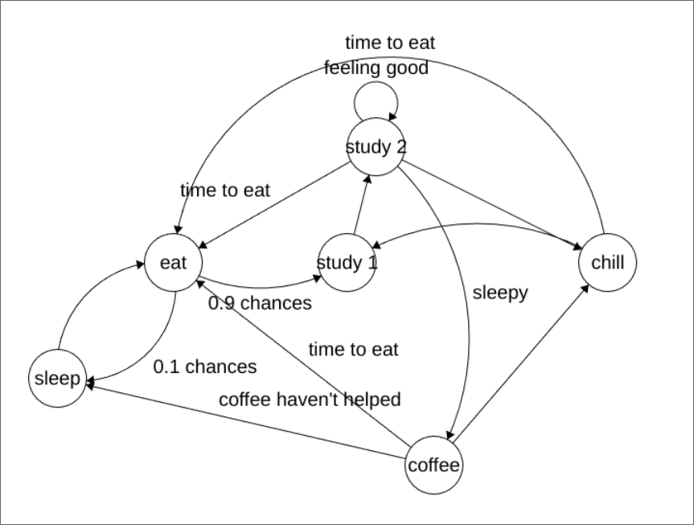

# sem_2_disc_lab_4

- [sem\_2\_disc\_lab\_4](#sem_2_disc_lab_4)
    - [Core states](#core-states)
    - [Random events](#random-events)

Finite state machine diagram

### Core states
- Sleeping state
- Eating state
- Studying state(divided in two, because studying session 2 hours long)
- Chilling state
- Coffeeing state

### Random events
Also in this FSM we have 4 possible random events that can infulence behavior:
- "Not much work" with chance 0.1 returns from Eating state to Sleeping state
- "Sleepy" with chance 0.6 will switch from Studying state to Coffee state
- "Feeling good" with chance 0.5 will cycle in Studying state
- "No use of coffee" with chance 0.2 will switch to Sleeping state after Coffee state

